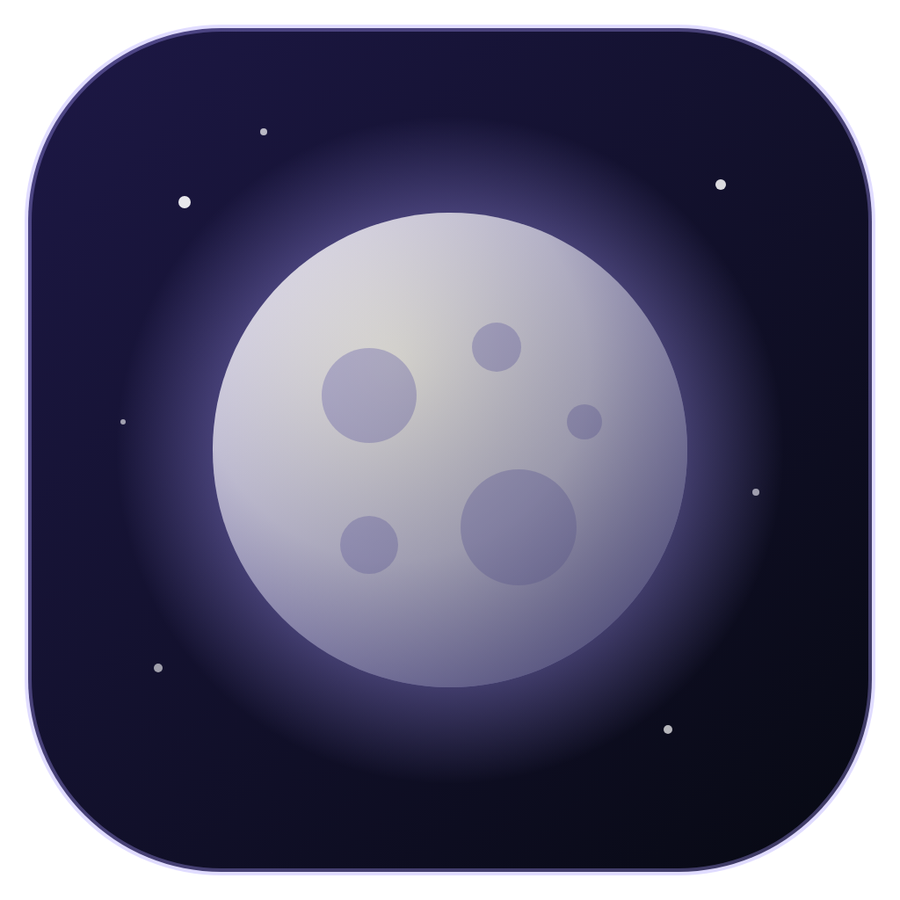
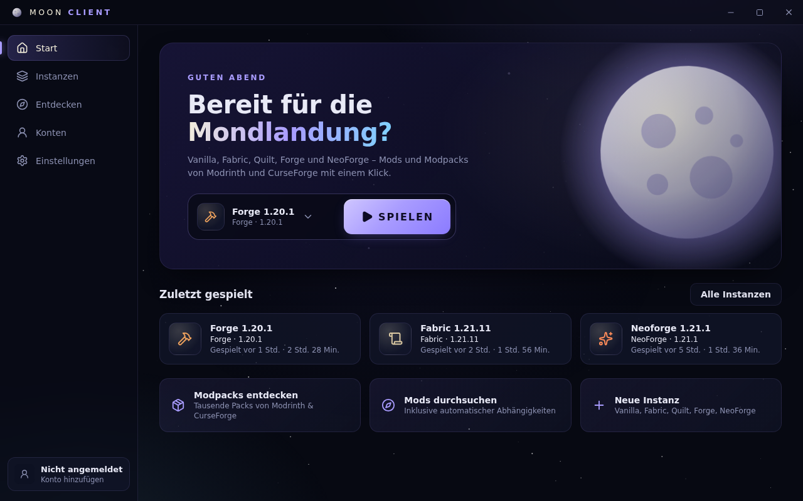

<p align="center">
  
</p>

<h1 align="center">Moon Client</h1>

<p align="center">
  Ein Minecraft-Launcher im Mond-Design – für <b>Vanilla, Fabric, Quilt, Forge und NeoForge</b>,<br/>
  mit Mods, Modpacks, Ressourcenpaketen und Shadern direkt von <b>Modrinth</b> und <b>CurseForge</b>.
</p>

<p align="center"></p>

## Features

- **Instanzen** – jede Instanz hat eigene Mods, Welten, Einstellungen, RAM und Java-Argumente.
- **Alle großen Mod-Loader** – Vanilla, Fabric, Quilt, Forge und NeoForge, inklusive Auswahl der Loader-Version
  (Forge/NeoForge werden mit dem offiziellen Installer im Hintergrund eingerichtet).
- **Modrinth & CurseForge** – Mods, Modpacks, Ressourcenpakete und Shader suchen und mit einem Klick installieren.
  Benötigte Abhängigkeiten (z. B. Sodium für Iris) werden automatisch mitinstalliert; es werden nur Versionen
  angezeigt, die zur Minecraft-Version und zum Loader der Instanz passen.
- **Modpacks** – Installation direkt aus der Suche oder Import von `.mrpack` (Modrinth) und CurseForge-`.zip`.
- **Automatisches Java** – lädt die von Mojang vorgesehene Java-Version (8, 17, 21, 25 …) passend zur Minecraft-Version.
- **Microsoft-Login** – sicher über den Microsoft-Gerätecode; Tokens werden mit der Schlüsselverwaltung des Systems verschlüsselt.
- **Mods verwalten** – aktivieren/deaktivieren, löschen, eigene `.jar`-Dateien hinzufügen.
- **Live-Logs** – die Ausgabe des Spiels direkt im Launcher, inkl. Fehler-Hervorhebung.
- **Mond-Theme** – Sternenhimmel, Mondlicht und Lavendel-Glow. Alle Farben stehen als Variablen in
  [`src/renderer/src/styles.css`](src/renderer/src/styles.css) und lassen sich leicht anpassen.

## Installation

Fertige Installer (Windows `.exe`, macOS `.dmg`, Linux `.AppImage`/`.deb`) werden von GitHub Actions gebaut:
**Actions → Build → letzter Lauf → Artifacts**. Für einen Tag `v*` (z. B. `v1.0.0`) wird automatisch ein Release erstellt – alternativ unter
**Actions → Build → Run workflow** eine Version eintragen.

## Selbst bauen

Voraussetzung: [Node.js](https://nodejs.org) 22 oder neuer.

```bash
npm install
npm run dev          # Launcher im Entwicklungsmodus starten
npm run dist         # Installer für das aktuelle Betriebssystem bauen (Ausgabe in dist/)
npm run dist:win     # bzw. :mac / :linux
```

## Einrichtung

### Microsoft-Login einrichten

Microsoft verlangt für Minecraft-Launcher eine eigene App-Registrierung:

1. Im [Azure-Portal → App-Registrierungen](https://portal.azure.com/#view/Microsoft_AAD_RegisteredApps/ApplicationsListBlade)
   eine neue App anlegen. Kontotyp: **„Nur persönliche Microsoft-Konten"**.
2. Unter **Authentifizierung** die Option **„Öffentliche Clientflows zulassen"** aktivieren.
3. Die **Anwendungs-ID (Client-ID)** kopieren.
4. Die App über das [Formular von Mojang](https://aka.ms/mce-reviewappid) für die Minecraft-API freischalten lassen.
   Ohne Freischaltung lehnt Minecraft die Anmeldung mit „403" ab.
5. Die Client-ID im Launcher unter **Einstellungen → Microsoft Client-ID** eintragen
   (oder beim Build als `MAIN_VITE_MSA_CLIENT_ID` setzen, siehe unten).

Offline-Konten (nur Einzelspieler/Offline-Server) stehen erst zur Verfügung, nachdem ein Microsoft-Konto mit Minecraft hinzugefügt wurde.

### CurseForge-API-Key

Modrinth funktioniert ohne Schlüssel. Für CurseForge wird ein kostenloser API-Key benötigt:

1. Auf [console.curseforge.com](https://console.curseforge.com/) anmelden und einen API-Key erstellen.
2. Den Key unter **Einstellungen → CurseForge-API-Key** eintragen.

Manche CurseForge-Autoren verbieten Downloads über Drittanbieter-Launcher. Solche Dateien kann der Launcher nicht
automatisch laden – er zeigt dann einen Link zum manuellen Download an.

### Schlüssel beim Build einbauen

Statt die Werte in den Einstellungen einzutragen, können sie beim Build in den Launcher eingebaut werden.
Lokal: `.env.example` nach `.env` kopieren und ausfüllen. In GitHub Actions: die Repository-Secrets
`CURSEFORGE_API_KEY` und `MSA_CLIENT_ID` anlegen. Hinweis: eingebaute Schlüssel lassen sich aus der App auslesen.

## Projektstruktur

```
src/
  main/                 Electron-Hauptprozess
    core/               Launcher-Kern (ohne Electron-Abhängigkeit)
      versions.ts       Mojang-Versionen, Regeln, Bibliotheken
      java.ts           Automatischer Java-Download (Mojang-Runtimes)
      loaders.ts        Fabric, Quilt, Forge, NeoForge
      launch.ts         Downloads (Bibliotheken, Assets) & Startargumente
      auth.ts           Microsoft → Xbox Live → Minecraft
      instances.ts      Instanzen & installierte Inhalte
      content/          Modrinth & CurseForge (Suche, Installation, Modpacks)
    accounts.ts, game.ts, settings.ts, index.ts (IPC)
  preload/              Sichere Brücke zwischen Oberfläche und Hauptprozess
  renderer/             React-Oberfläche (Seiten, Komponenten, Theme)
  shared/               Gemeinsame Typen
```

Daten (Instanzen, Bibliotheken, Java) liegen in `%APPDATA%\.moonclient` (Windows),
`~/Library/Application Support/.moonclient` (macOS) bzw. `~/.config/.moonclient` (Linux).
Mit der Umgebungsvariable `MOON_DATA_DIR` lässt sich ein anderer Ordner verwenden.

## Lizenz

[MIT](LICENSE) – Moon Client ist nicht mit Mojang oder Microsoft verbunden.
